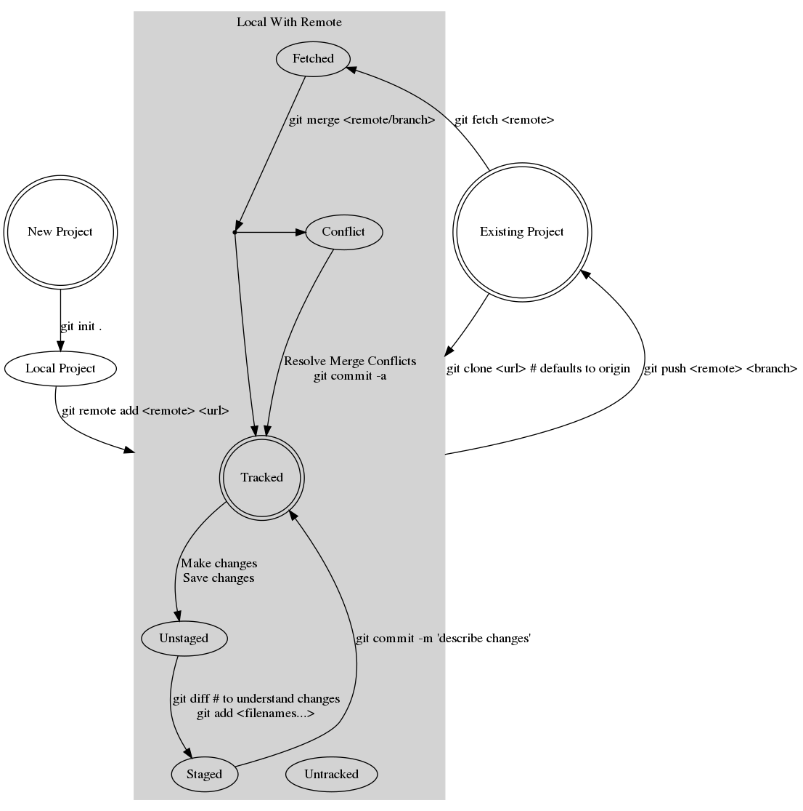

<!-- $theme: gaia -->

# Preable
**First 10 minutes** will be spent insuring everyone has
1. `Github` account
2. `git` installed on their computer.

Please sit in front of room if you haven't yet setup your environment

Please help your neighbors if you can

---
# Intro to Git

This talk will not cover, or expect knowlege of, programming languages

1. We will introduce vocabulary
2. Understand Simplest Workflow
3. Attendents will contribute to collaborative demo
4. Watch a more complete real world example

---
# What is Git?
- Source and version control
- Ledger of work
- Collaboration tool
- Workflow managment software

competes with : **hg**, **svn**, **cvs**, **darcs**

---
# What is Github?
- Git service provider
- Account managment and access control
- Hosting platform
- Ticket tracker / project management tool

competes with : **GitLab**, **bitbucket**, **coding.net**

---
## What to store (Github)?
- source code (language ambiguos)
- markdown / jupyter / pdf
- small or static images & datasets

## What NOT to store?
- PASSWORDS, secrets, or private keys
- binaries & executables (with rare exceptions)
- large or unstable images & datasets
- Non-parsable documents (Word, Photoshop, ...)

---
# Vocabulary
- Repository (local/remote)
- `init` / `clone`
- `commit` and Commit History
- `branch`
- `fetch`
- `diff`
- `merge` and Merge Conflicts
- `push`

---
# Simplest Git Workflow


---
# 

---
# Give me your Username in Exchange for A Ticket

---
# Git Commands
- `status`, `diff`
- `clone`, `init`
- `fetch`, `merge`, `commit`, `push`, `fetch`

```bash
$ git clone https://github.com/PortlandDataScienceGroup/ABC.git
Cloning into 'ABC'...
remote: Counting objects: 500, done.
remote: Compressing objects: 100% (36/36), done.
remote: Total 500 (delta 27), reused 33 (delta 12), pack-reused 451
Receiving objects: 100% (500/500), 6.72 MiB | 1.71 MiB/s, done.
Resolving deltas: 100% (286/286), done.
Checking connectivity... done.
$
```

---
# Go

---
# Github activities
- create / destroy user and organization accounts
- create / destroy repository
- fork
- issue creation / assigment / management
- `pull request`
- `gists`
