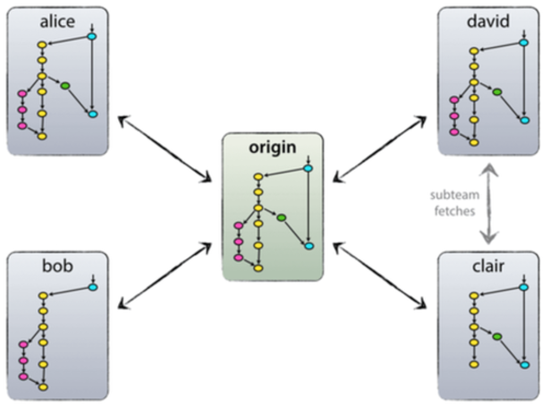
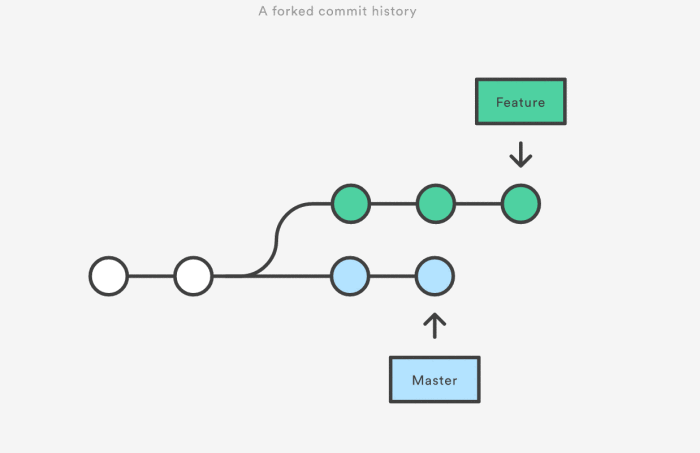

<!-- $theme: gaia -->

# Preamble
http://bit.ly/2yZWVpX

**First 10 minutes** will be used to ensure
1. `git` installed on your computer.
2. `Github` account setup & give username to speaker

Please sit in front of room if you haven't yet setup your environment

_If you didn't bring a computer, or are unfamilure with terminal commands, make a friend instead_

---
# Portland DSG

#### Thanks to <u>New Relic</u> for hosting this talk!

  

---
# Intro to Git

http://bit.ly/2yZWVpX

This talk will not cover, or expect, specific programming languages

1. Introduce collaborative demo
2. We will introduce vocabulary
3. Understand Simplest Workflow
4. Attendants will contribute to collaborative demo
5. Talk about access control and Github

---
# Why do you Care?
- No more emailing document revisions
- Simpler Local Files
- Remote Storage

---
# Your Project!
- After I assign you a **pannel** of content,
- add them to a file `README.md`
- belonging to an **existing repository**
- in **alphabetical order**.
- Finally, share your changes

```text
A is for Alice who fell down the stairs
B is for Basil assaulted by bears
C is for Clara who wasted away
...
Z is for Zillah who drank to much gin
```

---
# What is Git?
- Source and version control
- Ledger of work
- Collaboration tool
- Workflow management software

competes with : **hg**, **svn**, **cvs**

---
# What is Github?
- Git service provider
- Account management and access control
- Hosting platform
- Ticket tracker / project management tool

competes with : **GitLab**, **bitbucket**, **coding.net**

---
## What to store (Github)?
- source code (language ambiguous)
- markdown / Jupyter / pdf
- small or static images & data-sets

## What NOT to store?
- PASSWORDS, access tokens, or private keys
- compiled binaries
- large images & data-sets
- Non-pars-able documents (Word, Photoshop, ...)

---
# Passwords

```bash
$ cat secrets.json # this file should not be committed
{
    "password":"MySuperNeatoPassword!#"
}
```

```python
import json

# this file should be commited

with open('secrets.json') as fd:
    pwd = json.load(fd)['password']

print(pwd)
```

---
# Vocabulary (I)
- `remote` **labels alias another location**




---
# Vocabulary (II)
- `branch`



---
# Vocabulary (III)
- `init` / `clone` - Starts Project
- `add`/`commit` and Commit History - Tracks Changes
- `checkout` - change working copy to different revision/version
- `fetch`/`merge` and Merge Conflicts
- `push` - Share Changes
- `diff`, `status`, `log` - What state am I in?

---
## Merge Conflicts
```bash
$ git status
# On branch branch-b
...
# both modified:
```

```text
$ cat styleguide.md
If you have questions, please
<<<<<<<< HEAD
open an issue
========
ask your question in IRC.
>>>>>>>> branch-a
```

```text
$ cat styleguide.md
If you have questions, please open an issue or
ask your question in IRC.
```

---
# Workflow Map


---
# Message Flag and Editor

If you don't use the `-m` message flag, you will likely be subject to `vim`. `vim` can be a very frustrating file editor, if you don't bother to learn it.

_Look into how to change your default `EDITOR` for your operating system._

---
# Vim
To exit `vim`, Hit the `Esc` key to enter "Command mode". Then you can type `:` to enter "Command-line mode". A colon (`:`) will appear at the bottom of the screen and you can type in one of the following commands. To execute a command, press the `Enter` key.

  - `:q` to quit (short for `:quit`)
  - `:q!` to quit without saving (short for `:quit!`)
  - `:wq` to write and `quit`

---
# Defaults and `config`

```bash
$ git config --global user.name "John Doe"
$ git config --global user.email johndoe@example.com
```

---
# 

---
# Give me your Username in Exchange for A Ticket

---
# Rules of the Game (15 min)
- 10 people per repository team {Red, Blue, Black}
<<<<<<< HEAD
- No more than 80 characters per line
- This poem is expected ordered alphabetically
- Each ticket represents one letter of short story
- Your team is done when the remote repository is complete
=======
- Each pannel represents one entry from poem
- Pannel text split into lines of No more than 80 characters
- This poem is expected ordered alphabetically (by second word)
- Your team is done when distributed pannels are added
>>>>>>> 6067a1309927c9bbf94a838d2ca251bf3571ed26
- Do a `diff` against `origin/master` before a `merge`
- Review the `log` at least once (`q` to quit)

---
# Git Commands
- `status`, `diff`
- `clone`, `init`
- `fetch`, `merge`, `commit`, `push`, `fetch`

```bash
$ git clone https://github.com/PortlandDataScienceGroup/ABC.git
Cloning into 'ABC'...
remote: Counting objects: 500, done.
remote: Compressing objects: 100% (36/36), done.
remote: Total 500 (delta 27), reused 33 (delta 12), pack-reused 451
Receiving objects: 100% (500/500), 6.72 MiB | 1.71 MiB/s, done.
Resolving deltas: 100% (286/286), done.
Checking connectivity... done.
$
```

---
# Intermission

---
# Collaborating without Permission
Collaboration within a team is different than from outside, as a consiquence of access control.

- `fork` - Copies repository
- `pull request` - Shares changes

---
# Github activities
- Code reviews
- Create / destroy user and organization accounts
- Access control
- Create / destroy repository
- Issue creation / assignment / management
- Gists

---
# Steps
1. `fork` issue on Github
2. `clone` repository to local directory
3. `branch` to encapsulate our edits
4. Edit files, save and `commit` changes
5. `push` changes to branch on forked repository
6. `pull request` fork-branch on original repository

---
# Courtesy
- Look for a `CONTRIBUTORS.md` file
- Look for style guides
- Read documentation before collaborating
- Take code review feedback seriously and not personally

---
<<<<<<< HEAD
# Steps
1. Identify an issue
2. `fork` issue on Github
3. `clone` repository to local directory
4. `branch` to encapsulate our edits
5. Edit files, save and `commit` changes
6. `push` changes to branch on forked repository
7. `pull request` fork-branch on original repository
=======
# To Learn Next
- Understanding branching model, and verison numbers
- `GitFlow` http://nvie.com/posts/a-successful-git-branching-model/

---
# Portland DSG
>>>>>>> 6067a1309927c9bbf94a838d2ca251bf3571ed26
